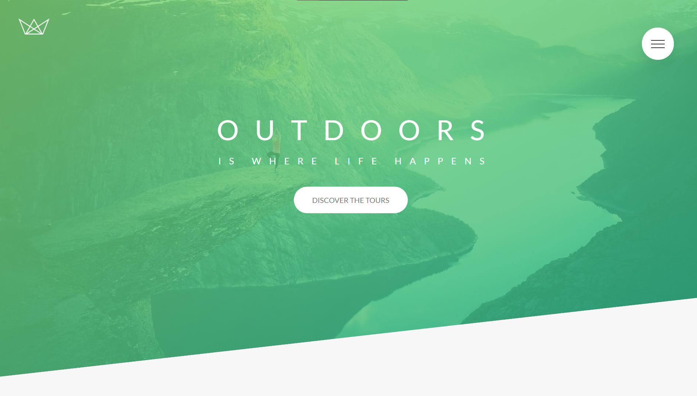

# Welcome to my CSS-Showcases

## This Repository
Purpose of this repository is to showcase some of the cool projects I've worked on over the time utilizing modern css, and also serve as a personal resource to come back to it whenever needed ✌

## Usage
This repo holds three different projects ([Natours](https://github.com/jaisharx/css-showcase/tree/master/Natours), [Trillo](https://github.com/jaisharx/css-showcase/tree/master/Trillo), [Nexter](https://github.com/jaisharx/css-showcase/tree/master/Nexter)) showcasing many modern CSS3 techniques. In order to get started with the repo, run following commands.

```bash
npm install
```

After successfully installing the required dependencies, the ```package.json``` comes with three pair of ```start``` and ```build``` npm scripts. For example:-

```bash
npm run start:trillo
```
or
```bash
npm build start:trillo
```
Running the build command would produce a dist folder that which you can serve using a static dev serve, also for each project I've it configured vai Netlify, so if all you want to do is look at the final end project. Open any of the following links. 😎


<div style="display: flex; ">
    <div style="text-align: center">
        <a href="https://css-showcase-natours.netlify.app/"></a>
        <a href="https://css-showcase-natours.netlify.app/">NATOURS</a>     
    </div>
    <div style="text-align: center; margin: 0 8px">
        <a href="https://css-showcase-trillo.netlify.app/"></a>
        <a href="https://css-showcase-trillo.netlify.app/">TRILLO</a>
    </div>
    <div style="text-align: center">
        <a href="https://css-showcase-nexter.netlify.app/"></a>
        <a href="https://css-showcase-nexter.netlify.app/">NEXTER</a>
    </div>
</div>

## Inspirations

**Projects in this repo are inspired from an amazing Udemy instructor: *Jonas Schmedtmann*** <br>
[Check his Udemny courses here](https://www.udemy.com/user/jonasschmedtmann/) **Enjoy** 🎉
