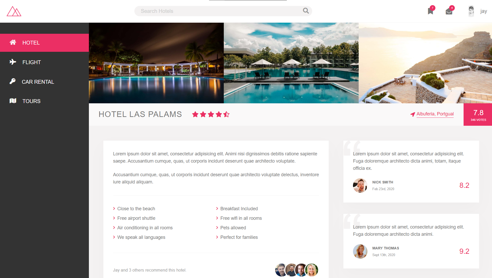

#  Welcome to Trillo | Flexbox powered project

[](https://app.netlify.com/sites/css-showcase-trillo/deploys)



Purpose of this repository is to showcase some of the cool projects I've worked on over the time utilizing modern css, and also serve as a personal resource to come back to it whenever needed ✌

## Usage
Run the following command in the root dir of this repo.
```bash
npm install
```

After successfully installing the required dependencies, you can
run the following command for development/testing build:

```bash
npm run start:trillo
```
or run this for production ready build:
```bash
npm build start:trillo
```

### Don't wanna go with any headache, simple open [this](https://css-showcase-trillo.netlify.app/) link 😎